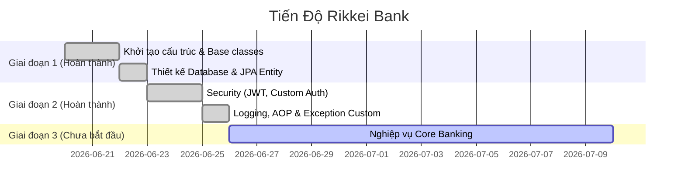
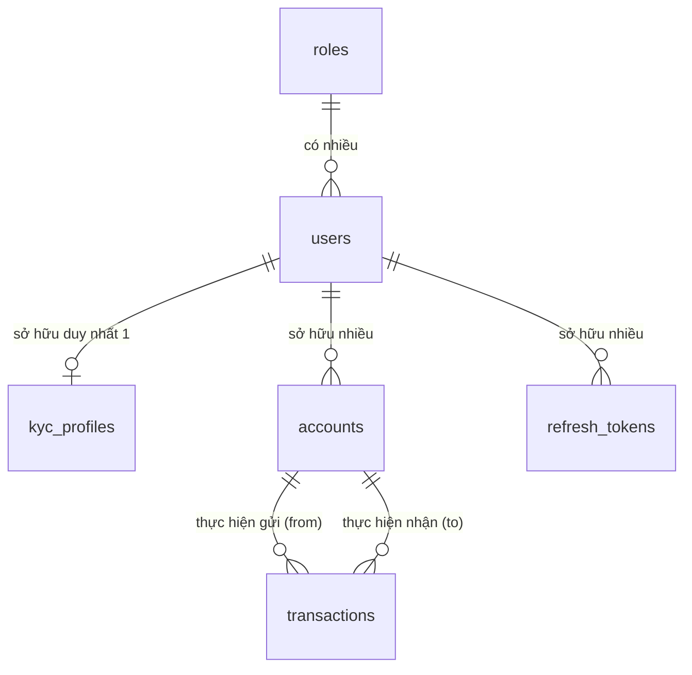

# 🏦 BÁO CÁO TỔNG QUAN DỰ ÁN RIKKEI BANK

---

## 📋 1. Thông Tin Chung

> [!NOTE]
> Dự án được xây dựng theo kiến trúc **Stateless Backend** nhằm cung cấp một hệ thống API RESTful an toàn, bảo mật cao và dễ dàng mở rộng cho các dịch vụ ngân hàng số.

*   **Tên dự án:** Hệ thống Quản lý Ngân hàng Rikkei Bank
*   **Loại ứng dụng:** Java Web Service cung cấp RESTful API (Stateless Backend)
*   **Công nghệ cốt lõi:**
    *   **Backend Framework:** Spring Boot 3.x, Spring Security (JWT)
    *   **Data Access Layer:** Spring Data JPA, Hibernate, MySQL
    *   **Tiện ích & Thư viện phụ trợ:** Lombok, MapStruct (Sử dụng Mapper thủ công theo quy chuẩn dự án)
*   **Nguyên tắc phát triển:**
    *   Tuân thủ nghiêm ngặt quy định trong [coding_rules.md](file:///d:/Phan%20Trung%20Ki%C3%AAn%20-%20PTIT/JAVA%20WEB%20SERVICE/Rikkei%20Bank/coding_rules.md).
    *   Phân chia Service và Repository theo cặp **Interface + Impl**.
    *   Map dữ liệu DTO - Entity thủ công (không sử dụng thư viện tự động để kiểm soát luồng dữ liệu).

---

## 🚀 2. Tiến Độ Dự Án & Các Tính Năng Đã Hoàn Thành



### ✅ Giai đoạn 1: Nền tảng & Cơ sở dữ liệu
*   Khởi tạo cấu trúc dự án chuẩn, cấu hình Gradle.
*   Thiết kế hệ thống Base classes (`ApiResponse`, `GlobalExceptionHandler`) nhằm nhất quán định dạng phản hồi API.
*   Tạo Entities và Repositories tương ứng với sơ đồ thực thể ngân hàng.

### ✅ Giai đoạn 2: Bảo mật & Xác thực & Hệ thống Logging
*   **Xác thực nâng cao (Security & JWT):**
    *   Tích hợp bộ lọc bảo mật JWT, Custom User Details Service.
    *   Hỗ trợ luồng Đăng ký, Đăng nhập, Làm mới Token (`refresh_tokens`), và Đăng xuất (Blacklist Access Token thông qua `token_blacklists`).
    *   Tạo Custom Exception `DuplicateResourceException` xử lý trùng lặp tài khoản và email chuyên biệt (trả về lỗi `409 Conflict`).
*   **Hệ thống Logging Doanh nghiệp (SLF4J & Logback):**
    *   **TraceID Filter:** Áp dụng `TraceIdFilter` tự động gán mã định danh duy nhất (UUID) qua MDC cho mỗi request để dễ dàng truy vết log.
    *   **AOP Tracing (`LoggingAspect`):** Tự động ghi nhận thông tin Class, Method, các tham số đầu vào và đo đạc chính xác thời gian thực thi (Performance Profiling) của mọi controller và service.
    *   **Logback XML:** Cấu hình nâng cao ghi log Console có màu sắc và lưu trữ file hàng ngày (`spring-boot-logger.log`), tự động tách các log lỗi nghiêm trọng ra file riêng biệt (`spring-boot-error.log`).
    *   **Bảo mật thông tin Log:** Áp dụng `@ToString.Exclude` tại các trường nhạy cảm như `password` trong `LoginRequest` và `RegisterRequest` để đảm bảo mật khẩu không bao giờ bị lộ ra log hệ thống dưới dạng clear-text.

### ⏳ Giai đoạn 3: Nghiệp vụ Core Banking (Chưa bắt đầu)
*   Thực hiện các tính năng KYC, Mở tài khoản thanh toán, Quản lý số dư, Chuyển tiền nội bộ/liên ngân hàng và Tra cứu lịch sử giao dịch.

---

## 📊 3. Sơ Đồ CSDL & Thiết Kế Thực Thể (ERD)

Sơ đồ CSDL chi tiết tương thích với công cụ dbdiagram.io có thể xem tại: [erd.md](file:///d:/Phan%20Trung%20Ki%C3%AAn%20-%20PTIT/JAVA%20WEB%20SERVICE/Rikkei%20Bank/erd.md).

### Sơ đồ quan hệ thực thể (ERD)



### Chi tiết các bảng dữ liệu

#### 🔐 Bảng `roles` (Phân quyền hệ thống)
| Tên trường | Kiểu dữ liệu | Ràng buộc | Mô tả |
| :--- | :--- | :--- | :--- |
| **`id`** | `bigint` | **PK**, Auto Increment | Khóa chính của bảng quyền |
| `name` | `varchar(255)` | Not Null, **Unique** | Tên quyền (Ví dụ: `ADMIN`, `CUSTOMER`) |
| `description` | `varchar(255)` | Nullable | Mô tả chi tiết chức năng của quyền đó |

#### 👤 Bảng `users` (Thông tin người dùng)
| Tên trường | Kiểu dữ liệu | Ràng buộc | Mô tả |
| :--- | :--- | :--- | :--- |
| **`id`** | `bigint` | **PK**, Auto Increment | Khóa chính |
| `username` | `varchar(255)` | Not Null, **Unique** | Tên tài khoản dùng để đăng nhập |
| `password` | `varchar(255)` | Not Null | Mật khẩu tài khoản (được băm bảo mật bằng BCrypt) |
| `phone_number` | `varchar(20)` | Not Null, **Unique** | Số điện thoại liên lạc |
| `email` | `varchar(255)` | Not Null, **Unique** | Địa chỉ hòm thư điện tử |
| `is_active` | `boolean` | Not Null, Default: `true` | Trạng thái kích hoạt (Cho phép hoạt động hay không) |
| `is_kyc` | `boolean` | Not Null, Default: `false` | Trạng thái duyệt hồ sơ định danh eKYC |
| `created_at` | `timestamp` | Not Null, Default: Current | Thời điểm đăng ký tài khoản |
| `role_id` | `bigint` | Not Null, **FK** | Trỏ tới bảng `roles` |

#### 🪪 Bảng `kyc_profiles` (Hồ sơ định danh eKYC)
| Tên trường | Kiểu dữ liệu | Ràng buộc | Mô tả |
| :--- | :--- | :--- | :--- |
| **`id`** | `bigint` | **PK**, Auto Increment | Khóa chính của hồ sơ |
| `id_number` | `varchar(50)` | Not Null, **Unique** | Số CCCD / CMND / Hộ chiếu |
| `full_name` | `varchar(255)` | Not Null | Họ và tên đầy đủ |
| `dob` | `date` | Not Null | Ngày tháng năm sinh |
| `sex` | `varchar(10)` | Not Null | Giới tính (MALE, FEMALE, OTHER) |
| `address` | `varchar(500)` | Not Null | Địa chỉ thường trú chi tiết |
| `id_card_front_url` | `varchar(500)` | Not Null | Đường dẫn ảnh chụp mặt trước thẻ CCCD |
| `status` | `varchar(50)` | Default: `'PENDING'` | Trạng thái hồ sơ: `PENDING`, `APPROVED`, `REJECTED` |
| `verified_at` | `timestamp` | Nullable | Thời điểm phê duyệt hoặc từ chối hồ sơ |
| `created_at` | `timestamp` | Not Null | Thời điểm gửi hồ sơ eKYC |
| `user_id` | `bigint` | Not Null, **Unique**, **FK**| Trỏ tới bảng `users` (Mối quan hệ 1:1) |

#### 💳 Bảng `accounts` (Tài khoản ngân hàng thanh toán)
| Tên trường | Kiểu dữ liệu | Ràng buộc | Mô tả |
| :--- | :--- | :--- | :--- |
| **`id`** | `bigint` | **PK**, Auto Increment | Khóa chính của tài khoản |
| `account_number` | `varchar(20)` | Not Null, **Unique** | Số tài khoản thanh toán dùng để giao dịch |
| `balance` | `decimal(18,2)` | Not Null, Default: `0` | Số dư hiện tại có trong tài khoản |
| `currency` | `varchar(10)` | Not Null, Default: `'VND'` | Đơn vị tiền tệ (mặc định VND) |
| `transaction_pin` | `varchar(255)` | Not Null | Mã PIN giao dịch 6 số (đã băm bảo mật) |
| `active` | `boolean` | Not Null, Default: `true` | Trạng thái hoạt động (Khóa/Mở tài khoản) |
| `updated_at` | `timestamp` | Not Null | Thời điểm cập nhật số dư cuối cùng |
| `created_at` | `timestamp` | Not Null | Ngày phát hành tài khoản |
| `user_id` | `bigint` | Not Null, **FK** | Chủ tài khoản, trỏ tới bảng `users` |

#### 💸 Bảng `transactions` (Lịch sử giao dịch tài chính)
| Tên trường | Kiểu dữ liệu | Ràng buộc | Mô tả |
| :--- | :--- | :--- | :--- |
| **`id`** | `bigint` | **PK**, Auto Increment | Khóa chính của giao dịch |
| `transaction_code` | `varchar(100)` | Not Null, **Unique** | Mã giao dịch duy nhất dùng để đối soát |
| `amount` | `decimal(18,2)` | Not Null | Số tiền phát sinh giao dịch |
| `description` | `varchar(500)` | Nullable | Nội dung chuyển khoản hoặc lý do giao dịch |
| `status` | `varchar(50)` | Not Null | Trạng thái giao dịch (`SUCCESS`, `PENDING`, `FAILED`) |
| `created_at` | `timestamp` | Not Null | Thời điểm thực hiện giao dịch |
| `from_account_id` | `bigint` | Nullable, **FK** | Tài khoản gửi (rỗng nếu là nạp tiền mặt) - Trỏ tới `accounts` |
| `to_account_id` | `bigint` | Nullable, **FK** | Tài khoản nhận (rỗng nếu là rút tiền mặt) - Trỏ tới `accounts` |

#### 🔑 Cơ chế bảo mật và quản lý Token
*   **`refresh_tokens`**: Dùng để quản lý các phiên làm việc lâu dài của người dùng. Gồm các trường: `token` (chuỗi UUID duy nhất), `expiry_date` (thời điểm hết hạn), `revoked` (trạng thái hủy bỏ token), và `user_id` (tham chiếu tới chủ sở hữu).
*   **`token_blacklists`**: Lưu trữ các Access Token (JWT) đã bị từ chối sau khi người dùng thực hiện đăng xuất (Logout). Gồm: `access_token` (Chuỗi JWT nguyên bản) và `expiry_at` (Hạn hết hiệu lực của token, dùng để chạy tác vụ dọn dẹp định kỳ dọn database).

---

## ⚡ 4. Danh Sách API (Postman Collection)

*   **Tệp tin Collection:** [Rikkei_Bank.postman_collection.json](file:///d:/Phan%20Trung%20Ki%C3%AAn%20-%20PTIT/JAVA%20WEB%20SERVICE/Rikkei%20Bank/Rikkei_Bank.postman_collection.json)

---

### 📂 4.1. Nhóm API Xác thực (Authentication)
*   **Base URL:** `/api/v1/auth`

#### 1. Đăng ký tài khoản mới (Register)
*   **Phương thức:** `POST`
*   **Đường dẫn:** `/register`
*   **Mô tả:** Đăng ký tài khoản người dùng mới. Tài khoản đăng ký thành công mặc định nhận vai trò `CUSTOMER`.
*   **Yêu cầu Request Body (JSON):**
    ```json
    {
      "username": "testuser",
      "password": "mySecurePassword123",
      "email": "testuser@gmail.com",
      "phoneNumber": "0987654321"
    }
    ```
*   **Phản hồi thành công (200 OK):**
    ```json
    {
      "id": 1,
      "username": "testuser",
      "email": "testuser@gmail.com",
      "phoneNumber": "0987654321",
      "isActive": true,
      "kyc": false,
      "role": "CUSTOMER",
      "createdAt": "2026-06-26T03:53:12Z"
    }
    ```
*   **Các mã phản hồi lỗi thường gặp:**
    *   `400 Bad Request`: Thiếu thông tin bắt buộc, email không hợp lệ, hoặc mật khẩu dưới 6 ký tự.
    *   `409 Conflict`: Tên tài khoản (`username`) hoặc địa chỉ Email đã được đăng ký bởi người dùng khác.

#### 2. Đăng nhập hệ thống (Login)
*   **Phương thức:** `POST`
*   **Đường dẫn:** `/login`
*   **Mô tả:** Xác thực danh tính người dùng và cấp mã Access Token kèm Refresh Token mới.
*   **Yêu cầu Request Body (JSON):**
    ```json
    {
      "username": "testuser",
      "password": "mySecurePassword123"
    }
    ```
*   **Phản hồi thành công (200 OK):**
    ```json
    {
      "accessToken": "eyJhbGciOiJIUzI1NiIsInR5cCI6IkpXVCJ9...",
      "refreshToken": "4a2b6d19-3d1f-4bb0-8aef-cd56c42908ff",
      "user": {
        "id": 1,
        "username": "testuser",
        "email": "testuser@gmail.com",
        "role": "CUSTOMER"
      }
    }
    ```
*   **Các mã phản hồi lỗi thường gặp:**
    *   `401 Unauthorized`: Sai tài khoản hoặc mật khẩu không chính xác.

#### 3. Làm mới mã truy cập (Refresh Token)
*   **Phương thức:** `POST`
*   **Đường dẫn:** `/refresh`
*   **Mô tả:** Nhận một Access Token mới mà không yêu cầu nhập lại mật khẩu bằng cách gửi lên một Refresh Token còn hạn hợp lệ.
*   **Yêu cầu Request Body (JSON):**
    ```json
    {
      "refreshToken": "4a2b6d19-3d1f-4bb0-8aef-cd56c42908ff"
    }
    ```
*   **Phản hồi thành công (200 OK):**
    ```json
    {
      "accessToken": "eyJhbGciOiJIUzI1NiIsInR5cCI6IkpXVCJ9.newAccessToken..."
    }
    ```
*   **Các mã phản hồi lỗi thường gặp:**
    *   `400 Bad Request`: Refresh Token bị sai, không tồn tại hoặc đã hết hạn/bị thu hồi trước đó.

#### 4. Đăng xuất hệ thống (Logout)
*   **Phương thức:** `POST`
*   **Đường dẫn:** `/logout`
*   **Mô tả:** Hủy phiên làm việc hiện tại, lập tức đưa Access Token gửi kèm vào danh sách đen (Blacklist) để chặn tái sử dụng.
*   **Yêu cầu Headers:**
    *   `Authorization`: `Bearer {{accessToken}}`
*   **Yêu cầu Request Body:** Không có.
*   **Phản hồi thành công (200 OK):** *(Trống - Không phản hồi nội dung trong Body)*
*   **Các mã phản hồi lỗi thường gặp:**
    *   `401 Unauthorized`: Token bị thiếu, sai cấu trúc hoặc đã hết hạn trước khi đăng xuất.

---

### 📂 4.2. Nhóm API Người dùng (Users)
*   **Base URL:** `/api/v1/users`

#### 1. Lấy toàn bộ danh sách người dùng
*   **Phương thức:** `GET`
*   **Đường dẫn:** `/`
*   **Mô tả:** Trả về danh sách tất cả các tài khoản người dùng có trên hệ thống. *(Lưu ý: Endpoint này đang được để cấu hình Public để hỗ trợ việc kiểm tra dữ liệu đăng ký thuận tiện).*
*   **Yêu cầu Headers & Body:** Không có.
*   **Phản hồi thành công (200 OK):**
    ```json
    [
      {
        "id": 1,
        "username": "testuser",
        "email": "testuser@gmail.com",
        "phoneNumber": "0987654321",
        "isActive": true,
        "kyc": false,
        "role": "CUSTOMER",
        "createdAt": "2026-06-26T03:53:12Z"
      }
    ]
    ```

---

## 🔄 5. Quy Trình Phát Triển (Workflow Bắt Buộc)

> [!IMPORTANT]
> Để duy trì tính nhất quán của hệ thống, mọi thay đổi liên quan đến cấu trúc CSDL hoặc hành vi của API bắt buộc phải cập nhật đồng thời trên 3 thành phần sau:

1.  **Tài liệu Dự án (`report.md`)**: Cập nhật lại tiến độ, bổ sung mô tả API mới, cập nhật bảng trường dữ liệu nếu có sự thay đổi.
2.  **Sơ đồ CSDL (`erd.md`)**: Chỉnh sửa chính xác schema thực thể, quan hệ khóa ngoại để luôn đồng bộ với thiết kế trong mã nguồn JPA Entity.
3.  **Tài nguyên Postman (`Rikkei_Bank.postman_collection.json`)**:
    *   Cập nhật các request kiểm thử tương ứng.
    *   Phải thiết kế đầy đủ các tình huống kiểm thử (Success, 400 Bad Request, 404 Not Found, 409 Conflict...).
    *   Sử dụng biến môi trường hợp lý (ví dụ: `{{accessToken}}` trong header).
    *   **Không đặt icon/emojis** vào tên của các folder/request trong Postman để tránh lỗi hiển thị.
