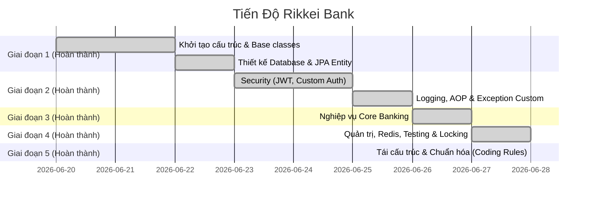
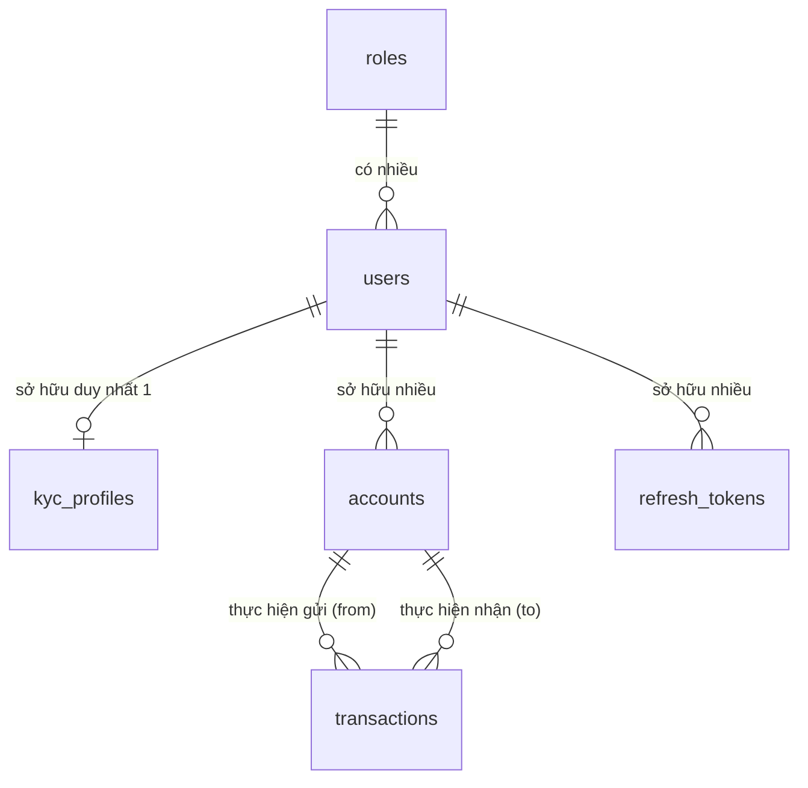

# 🏦 BÁO CÁO TỔNG QUAN DỰ ÁN RIKKEI BANK

---

## 📋 1. Thông Tin Chung

> [!NOTE]
> Dự án được xây dựng theo kiến trúc **Stateless Backend** nhằm cung cấp một hệ thống API RESTful an toàn, bảo mật cao và dễ dàng mở rộng cho các dịch vụ ngân hàng số.

*   **Tên dự án:** Hệ thống Quản lý Ngân hàng Rikkei Bank
*   **Loại ứng dụng:** Java Web Service cung cấp RESTful API (Stateless Backend)
*   **Công nghệ cốt lõi:**
    *   **Backend Framework:** Spring Boot 3.x, Spring Security (JWT)
    *   **Data Access Layer:** Spring Data JPA, Hibernate, MySQL
    *   **Tiện ích & Thư viện phụ trợ:** Lombok, MapStruct (Sử dụng Mapper thủ công theo quy chuẩn dự án)
*   **Nguyên tắc phát triển:**
    *   Tuân thủ nghiêm ngặt quy định trong [coding_rules.md](file:///d:/Phan%20Trung%20Ki%C3%AAn%20-%20PTIT/JAVA%20WEB%20SERVICE/Rikkei%20Bank/coding_rules.md).
    *   Phân chia Service và Repository theo cặp **Interface + Impl**.
    *   Map dữ liệu DTO - Entity thủ công (không sử dụng thư viện tự động để kiểm soát luồng dữ liệu).

---

## 🚀 2. Tiến Độ Dự Án & Các Tính Năng Đã Hoàn Thành



### ✅ Giai đoạn 1: Nền tảng & Cơ sở dữ liệu
*   Khởi tạo cấu trúc dự án chuẩn, cấu hình Gradle.
*   Thiết kế hệ thống Base classes (`ApiResponse`, `GlobalExceptionHandler`) nhằm nhất quán định dạng phản hồi API.
*   Tạo Entities và Repositories tương ứng với sơ đồ thực thể ngân hàng.

### ✅ Giai đoạn 2: Bảo mật & Xác thực & Hệ thống Logging
*   **Xác thực nâng cao (Security & JWT):**
    *   Tích hợp bộ lọc bảo mật JWT, Custom User Details Service.
    *   Hỗ trợ luồng Đăng ký, Đăng nhập, Làm mới Token (`refresh_tokens`), và Đăng xuất (Blacklist Access Token thông qua `token_blacklists`).
    *   Tạo Custom Exception `DuplicateResourceException` xử lý trùng lặp tài khoản và email chuyên biệt (trả về lỗi `409 Conflict`).
*   **Hệ thống Logging Doanh nghiệp (SLF4J & Logback):**
    *   **TraceID Filter:** Áp dụng `TraceIdFilter` tự động gán mã định danh duy nhất (UUID) qua MDC cho mỗi request để dễ dàng truy vết log.
    *   **AOP Tracing (`LoggingAspect`):** Tự động ghi nhận thông tin Class, Method, các tham số đầu vào và đo đạc chính xác thời gian thực thi (Performance Profiling) của mọi controller và service.
    *   **Logback XML:** Cấu hình nâng cao ghi log Console có màu sắc và lưu trữ file hàng ngày (`spring-boot-logger.log`), tự động tách các log lỗi nghiêm trọng ra file riêng biệt (`spring-boot-error.log`).
    *   **Bảo mật thông tin Log:** Áp dụng `@ToString.Exclude` tại các trường nhạy cảm như `password` trong `LoginRequest` và `RegisterRequest` để đảm bảo mật khẩu không bao giờ bị lộ ra log hệ thống dưới dạng clear-text.

### ✅ Giai đoạn 3: Nghiệp vụ Core Banking
*   Đã hoàn tất tích hợp và kiểm thử toàn bộ các tính năng định danh eKYC (`KycController`, `AdminKycController`), Mở và Quản lý tài khoản thanh toán (`AccountController` với số tài khoản sinh tự động 10 chữ số độc nhất, mã PIN giao dịch băm bảo mật), thực hiện giao dịch chuyển tiền an toàn (`TransactionController` có `@Transactional` kiểm soát số dư nguồn/đích, so khớp mã PIN và ghi log cảnh báo mức `WARN` đối với các lỗi nghiệp vụ `BusinessException`).
*   Bổ sung tệp log `spring-boot-warning.log` thu thập riêng các cảnh báo nghiệp vụ (như validation fail, lỗi chuyển tiền, 404 Not Found, Malformed JSON...).

### ✅ Giai đoạn 4: Quản trị, Redis Blacklist, Khóa bi quan & Unit Test
*   **Quản trị & Phân trang (FR-05):** Cập nhật `UserController` cho phép Admin/Staff xem danh sách người dùng phân trang bằng **JPQL Constructor Projection** để tối ưu RAM, bật/tắt trạng thái hoạt động và xóa người dùng.
*   **Bảo mật nâng cao & Redis (FR-13):** Tách `TokenBlacklist` khỏi Database, sử dụng **Redis** để lưu các Access Token bị thu hồi khi đăng xuất với TTL tự động theo thời hạn còn lại của JWT. Hỗ trợ cơ chế fallback an toàn về ConcurrentHashMap nếu Redis offline.
*   **Chống chi tiêu kép (FR-07):** Áp dụng **Pessimistic Write Lock** tại tầng Database khi truy vấn tài khoản thực hiện chuyển tiền.
*   **Duyệt eKYC liên vai trò (FR-09):** Chuyển endpoint duyệt eKYC về `/api/v1/staff/kyc/...` để cả vai trò `ADMIN` và `STAFF` cùng thao tác.
*   **Đổi mật khẩu (FR-10):** Hỗ trợ API `/api/v1/users/me/password` đổi mật khẩu đơn giản cho người dùng đã xác thực.
*   **Đo lường & Log kiểm toán (FR-11):** Nâng cấp AOP ghi nhận log kiểm toán riêng biệt `[AUDIT] Account A transferred Amount to Account B` khi giao dịch thành công/thất bại, kèm đo lường hiệu năng của mọi hàm.
*   **Kiểm thử tự động (FR-12):** Hoàn thành tối thiểu 10 unit test (7 cho Service, 5 cho Controller) sử dụng Mockito và standalone MockMvc, đảm bảo build và test pass 100%.

### ✅ Giai đoạn 5: Tái cấu trúc & Chuẩn hóa (Coding Rules)
*   **Chống N+1 Query (Rule 15):** Áp dụng `JOIN FETCH` trong `TransactionRepository` và `@EntityGraph` trong `KycProfileRepository`.
*   **Custom Validator (Rule 7):** Xây dựng `@UniqueUsername`, `@UniqueEmail`, `@UniqueIdNumber` xử lý kiểm tra trùng lặp Database.
*   **Cấu hình & Spring Profiles (Rule 13):** Sử dụng `application.yml` và `application-local.yml`, cấu hình `@ConfigurationProperties` cho JWT, loại bỏ hardcode qua biến môi trường.
*   **Giám sát (Rule 12):** Tích hợp Spring Boot Actuator (`/actuator/health`, `/actuator/metrics`).

---

## 📊 3. Sơ Đồ CSDL & Thiết Kế Thực Thể (ERD)

Sơ đồ CSDL chi tiết tương thích với công cụ dbdiagram.io có thể xem tại: [erd.md](file:///d:/Phan%20Trung%20Ki%C3%AAn%20-%20PTIT/JAVA%20WEB%20SERVICE/Rikkei%20Bank/erd.md).

### Sơ đồ quan hệ thực thể (ERD)



### Chi tiết các bảng dữ liệu

#### 🔐 Bảng `roles` (Phân quyền hệ thống)
| Tên trường | Kiểu dữ liệu | Ràng buộc | Mô tả |
| :--- | :--- | :--- | :--- |
| **`id`** | `bigint` | **PK**, Auto Increment | Khóa chính của bảng quyền |
| `name` | `varchar(255)` | Not Null, **Unique** | Tên quyền (Ví dụ: `ADMIN`, `CUSTOMER`) |
| `description` | `varchar(255)` | Nullable | Mô tả chi tiết chức năng của quyền đó |

#### 👤 Bảng `users` (Thông tin người dùng)
| Tên trường | Kiểu dữ liệu | Ràng buộc | Mô tả |
| :--- | :--- | :--- | :--- |
| **`id`** | `bigint` | **PK**, Auto Increment | Khóa chính |
| `username` | `varchar(255)` | Not Null, **Unique** | Tên tài khoản dùng để đăng nhập |
| `password` | `varchar(255)` | Not Null | Mật khẩu tài khoản (được băm bảo mật bằng BCrypt) |
| `phone_number` | `varchar(20)` | Not Null, **Unique** | Số điện thoại liên lạc |
| `email` | `varchar(255)` | Not Null, **Unique** | Địa chỉ hòm thư điện tử |
| `is_active` | `boolean` | Not Null, Default: `true` | Trạng thái kích hoạt (Cho phép hoạt động hay không) |
| `is_kyc` | `boolean` | Not Null, Default: `false` | Trạng thái duyệt hồ sơ định danh eKYC |
| `created_at` | `timestamp` | Not Null, Default: Current | Thời điểm đăng ký tài khoản |
| `role_id` | `bigint` | Not Null, **FK** | Trỏ tới bảng `roles` |

#### 🪪 Bảng `kyc_profiles` (Hồ sơ định danh eKYC)
| Tên trường | Kiểu dữ liệu | Ràng buộc | Mô tả |
| :--- | :--- | :--- | :--- |
| **`id`** | `bigint` | **PK**, Auto Increment | Khóa chính của hồ sơ |
| `id_number` | `varchar(50)` | Not Null, **Unique** | Số CCCD / CMND / Hộ chiếu |
| `full_name` | `varchar(255)` | Not Null | Họ và tên đầy đủ |
| `dob` | `date` | Not Null | Ngày tháng năm sinh |
| `sex` | `varchar(10)` | Not Null | Giới tính (MALE, FEMALE, OTHER) |
| `address` | `varchar(500)` | Not Null | Địa chỉ thường trú chi tiết |
| `id_card_front_url` | `varchar(500)` | Not Null | Đường dẫn ảnh chụp mặt trước thẻ CCCD |
| `status` | `varchar(50)` | Default: `'PENDING'` | Trạng thái hồ sơ: `PENDING`, `APPROVED`, `REJECTED` |
| `verified_at` | `timestamp` | Nullable | Thời điểm phê duyệt hoặc từ chối hồ sơ |
| `created_at` | `timestamp` | Not Null | Thời điểm gửi hồ sơ eKYC |
| `user_id` | `bigint` | Not Null, **Unique**, **FK**| Trỏ tới bảng `users` (Mối quan hệ 1:1) |

#### 💳 Bảng `accounts` (Tài khoản ngân hàng thanh toán)
| Tên trường | Kiểu dữ liệu | Ràng buộc | Mô tả |
| :--- | :--- | :--- | :--- |
| **`id`** | `bigint` | **PK**, Auto Increment | Khóa chính của tài khoản |
| `account_number` | `varchar(20)` | Not Null, **Unique** | Số tài khoản thanh toán dùng để giao dịch |
| `balance` | `decimal(18,2)` | Not Null, Default: `0` | Số dư hiện tại có trong tài khoản |
| `currency` | `varchar(10)` | Not Null, Default: `'VND'` | Đơn vị tiền tệ (mặc định VND) |
| `transaction_pin` | `varchar(255)` | Not Null | Mã PIN giao dịch 6 số (đã băm bảo mật) |
| `active` | `boolean` | Not Null, Default: `true` | Trạng thái hoạt động (Khóa/Mở tài khoản) |
| `updated_at` | `timestamp` | Not Null | Thời điểm cập nhật số dư cuối cùng |
| `created_at` | `timestamp` | Not Null | Ngày phát hành tài khoản |
| `user_id` | `bigint` | Not Null, **FK** | Chủ tài khoản, trỏ tới bảng `users` |

#### 💸 Bảng `transactions` (Lịch sử giao dịch tài chính)
| Tên trường | Kiểu dữ liệu | Ràng buộc | Mô tả |
| :--- | :--- | :--- | :--- |
| **`id`** | `bigint` | **PK**, Auto Increment | Khóa chính của giao dịch |
| `transaction_code` | `varchar(100)` | Not Null, **Unique** | Mã giao dịch duy nhất dùng để đối soát |
| `amount` | `decimal(18,2)` | Not Null | Số tiền phát sinh giao dịch |
| `description` | `varchar(500)` | Nullable | Nội dung chuyển khoản hoặc lý do giao dịch |
| `status` | `varchar(50)` | Not Null | Trạng thái giao dịch (`SUCCESS`, `PENDING`, `FAILED`) |
| `created_at` | `timestamp` | Not Null | Thời điểm thực hiện giao dịch |
| `from_account_id` | `bigint` | Nullable, **FK** | Tài khoản gửi (rỗng nếu là nạp tiền mặt) - Trỏ tới `accounts` |
| `to_account_id` | `bigint` | Nullable, **FK** | Tài khoản nhận (rỗng nếu là rút tiền mặt) - Trỏ tới `accounts` |

#### 🔑 Cơ chế bảo mật và quản lý Token
*   **`refresh_tokens`**: Dùng để quản lý các phiên làm việc lâu dài của người dùng. Gồm các trường: `token` (chuỗi UUID duy nhất), `expiry_date` (thời điểm hết hạn), `revoked` (trạng thái hủy bỏ token), và `user_id` (tham chiếu tới chủ sở hữu).
*   **`token_blacklists`**: Lưu trữ các Access Token (JWT) đã bị từ chối sau khi người dùng thực hiện đăng xuất (Logout). Gồm: `access_token` (Chuỗi JWT nguyên bản) và `expiry_at` (Hạn hết hiệu lực của token, dùng để chạy tác vụ dọn dẹp định kỳ dọn database).

---

## ⚡ 4. Danh Sách API (Postman Collection)

*   **Tệp tin Collection:** [Rikkei_Bank.postman_collection.json](file:///d:/Phan%20Trung%20Ki%C3%AAn%20-%20PTIT/JAVA%20WEB%20SERVICE/Rikkei%20Bank/Rikkei_Bank.postman_collection.json)

---

### 📂 4.1. Nhóm API Xác thực (Authentication)
*   **Base URL:** `/api/v1/auth`

#### 1. Đăng ký tài khoản mới (Register)
*   **Phương thức:** `POST`
*   **Đường dẫn:** `/register`
*   **Mô tả:** Đăng ký tài khoản người dùng mới. Tài khoản đăng ký thành công mặc định nhận vai trò `CUSTOMER`.
*   **Yêu cầu Request Body (JSON):**
    ```json
    {
      "username": "testuser",
      "password": "mySecurePassword123",
      "email": "testuser@gmail.com",
      "phoneNumber": "0987654321"
    }
    ```
*   **Phản hồi thành công (200 OK):**
    ```json
    {
      "id": 1,
      "username": "testuser",
      "email": "testuser@gmail.com",
      "phoneNumber": "0987654321",
      "isActive": true,
      "kyc": false,
      "role": "CUSTOMER",
      "createdAt": "2026-06-26T03:53:12Z"
    }
    ```
*   **Các mã phản hồi lỗi thường gặp:**
    *   `400 Bad Request`: Thiếu thông tin bắt buộc, email không hợp lệ, hoặc mật khẩu dưới 6 ký tự.
    *   `409 Conflict`: Tên tài khoản (`username`) hoặc địa chỉ Email đã được đăng ký bởi người dùng khác.

#### 2. Đăng nhập hệ thống (Login)
*   **Phương thức:** `POST`
*   **Đường dẫn:** `/login`
*   **Mô tả:** Xác thực danh tính người dùng và cấp mã Access Token kèm Refresh Token mới.
*   **Yêu cầu Request Body (JSON):**
    ```json
    {
      "username": "testuser",
      "password": "mySecurePassword123"
    }
    ```
*   **Phản hồi thành công (200 OK):**
    ```json
    {
      "accessToken": "eyJhbGciOiJIUzI1NiIsInR5cCI6IkpXVCJ9...",
      "refreshToken": "4a2b6d19-3d1f-4bb0-8aef-cd56c42908ff",
      "user": {
        "id": 1,
        "username": "testuser",
        "email": "testuser@gmail.com",
        "role": "CUSTOMER"
      }
    }
    ```
*   **Các mã phản hồi lỗi thường gặp:**
    *   `401 Unauthorized`: Sai tài khoản hoặc mật khẩu không chính xác.

#### 3. Làm mới mã truy cập (Refresh Token)
*   **Phương thức:** `POST`
*   **Đường dẫn:** `/refresh`
*   **Mô tả:** Nhận một Access Token mới mà không yêu cầu nhập lại mật khẩu bằng cách gửi lên một Refresh Token còn hạn hợp lệ.
*   **Yêu cầu Request Body (JSON):**
    ```json
    {
      "refreshToken": "4a2b6d19-3d1f-4bb0-8aef-cd56c42908ff"
    }
    ```
*   **Phản hồi thành công (200 OK):**
    ```json
    {
      "accessToken": "eyJhbGciOiJIUzI1NiIsInR5cCI6IkpXVCJ9.newAccessToken..."
    }
    ```
*   **Các mã phản hồi lỗi thường gặp:**
    *   `400 Bad Request`: Refresh Token bị sai, không tồn tại hoặc đã hết hạn/bị thu hồi trước đó.

#### 4. Đăng xuất hệ thống (Logout)
*   **Phương thức:** `POST`
*   **Đường dẫn:** `/logout`
*   **Mô tả:** Hủy phiên làm việc hiện tại, lập tức đưa Access Token gửi kèm vào danh sách đen (Blacklist) để chặn tái sử dụng.
*   **Yêu cầu Headers:**
    *   `Authorization`: `Bearer {{accessToken}}`
*   **Yêu cầu Request Body:** Không có.
*   **Phản hồi thành công (200 OK):** *(Trống - Không phản hồi nội dung trong Body)*
*   **Các mã phản hồi lỗi thường gặp:**
    *   `401 Unauthorized`: Token bị thiếu, sai cấu trúc hoặc đã hết hạn trước khi đăng xuất.

---

### 📂 4.2. Nhóm API Quản trị & Người dùng (Users & Staff)
*   **Base URL:**
    *   Người dùng: `/api/v1/users`
    *   Quản trị viên: `/api/v1/staff/users`

#### 1. Lấy danh sách người dùng phân trang (Get All Users)
*   **Phương thức:** `GET`
*   **Đường dẫn:** `/api/v1/staff/users`
*   **Mô tả:** Trả về danh sách phân trang người dùng bằng JPQL Constructor Projection (Chỉ dành cho ADMIN, STAFF).
*   **Query Parameters:**
    *   `page` (int, default: 0): Số trang.
    *   `size` (int, default: 10): Số lượng phần tử mỗi trang.
*   **Yêu cầu Headers:**
    *   `Authorization`: `Bearer {{accessToken}}`
*   **Phản hồi thành công (200 OK):**
    ```json
    {
      "success": true,
      "code": 200,
      "message": "Lấy danh sách người dùng thành công",
      "data": {
        "content": [
          {
            "id": 1,
            "username": "testuser",
            "email": "testuser@gmail.com",
            "phoneNumber": "0987654321",
            "isActive": true,
            "kyc": false,
            "role": "CUSTOMER",
            "createdAt": "2026-06-26T03:53:12"
          }
        ],
        "pageable": "...",
        "totalPages": 1,
        "totalElements": 1
      }
    }
    ```

#### 2. Khóa người dùng dây chuyền (Lock User)
*   **Phương thức:** `POST`
*   **Đường dẫn:** `/api/v1/staff/users/{id}/lock`
*   **Mô tả:** Khóa hoạt động người dùng và đồng thời khóa toàn bộ các tài khoản thanh toán của họ (Chỉ dành cho ADMIN, STAFF).
*   **Yêu cầu Headers:**
    *   `Authorization`: `Bearer {{accessToken}}`

#### 3. Mở khóa người dùng (Unlock User)
*   **Phương thức:** `POST`
*   **Đường dẫn:** `/api/v1/staff/users/{id}/unlock`
*   **Mô tả:** Mở khóa hoạt động người dùng và mở khóa lại toàn bộ các tài khoản thanh toán tương ứng (Chỉ dành cho ADMIN, STAFF).
*   **Yêu cầu Headers:**
    *   `Authorization`: `Bearer {{accessToken}}`

#### 4. Đổi mật khẩu cá nhân (Change Password)
*   **Phương thức:** `PUT`
*   **Đường dẫn:** `/api/v1/users/me/password`
*   **Mô tả:** Cho phép người dùng đang đăng nhập tự đổi mật khẩu.
*   **Yêu cầu Headers:**
    *   `Authorization`: `Bearer {{accessToken}}`
*   **Yêu cầu Request Body (JSON):**
    ```json
    {
      "oldPassword": "mySecurePassword123",
      "newPassword": "newSecurePassword456"
    }
    ```

---

### 📂 4.3. Nhóm API Định Danh eKYC (eKYC)
*   **Base URL:**
    *   Khách hàng: `/api/v1/kyc`
    *   Quản trị viên: `/api/v1/staff/kyc`

#### 1. Nộp hồ sơ định danh (Submit KYC)
*   **Phương thức:** `POST`
*   **Đường dẫn:** `/api/v1/kyc`
*   **Mô tả:** Khách hàng nộp hồ sơ eKYC cá nhân. Hỗ trợ ghi đè/nộp lại hồ sơ mới nếu trạng thái trước đó bị STAFF/ADMIN từ chối (`REJECT`).
*   **Yêu cầu Headers:**
    *   `Authorization`: `Bearer {{accessToken}}`
*   **Yêu cầu Request Body (multipart/form-data):**
    *   `idNumber` (text): Số CMND/CCCD (9 hoặc 12 chữ số)
    *   `fullName` (text): Họ và tên khách hàng
    *   `dob` (text): Ngày sinh (Định dạng: `YYYY-MM-DD`)
    *   `sex` (text): Giới tính
    *   `address` (text): Địa chỉ
    *   `image` (file): Tệp ảnh mặt trước thẻ căn cước (hệ thống sẽ tự động upload lên Cloudinary)
*   **Phản hồi thành công (200 OK):** Trả về chi tiết `KycResponse`.

#### 2. Xem hồ sơ định danh cá nhân (Get My KYC)
*   **Phương thức:** `GET`
*   **Đường dẫn:** `/api/v1/kyc`
*   **Mô tả:** Khách hàng xem lại thông tin hồ sơ định danh cá nhân của mình.
*   **Yêu cầu Headers:**
    *   `Authorization`: `Bearer {{accessToken}}`

#### 3. Duyệt hồ sơ eKYC (Staff/Admin Update Status)
*   **Phương thức:** `PUT`
*   **Đường dẫn:** `/api/v1/staff/kyc/{id}/status`
*   **Mô tả:** Staff hoặc Admin thực hiện phê duyệt (`CONFIRM`) hoặc từ chối (`REJECT` - yêu cầu bắt buộc nhập kèm lý do từ chối cụ thể) đối với hồ sơ eKYC của khách hàng.
*   **Yêu cầu Headers:**
    *   `Authorization`: `Bearer {{accessToken}}`
*   **Yêu cầu Request Body (JSON):**
    ```json
    {
      "status": "REJECT",
      "rejectionReason": "Hình ảnh CCCD bị mờ, không rõ số"
    }
    ```

---

### 📂 4.4. Nhóm API Quản Lý Tài Khoản & Giao Dịch (Accounts & Transactions)
*   **Base URL:**
    *   Khách hàng: `/api/v1/accounts`
    *   Quản trị viên: `/api/v1/staff/accounts`

#### 1. Mở tài khoản thanh toán mới (Create Account)
*   **Phương thức:** `POST`
*   **Đường dẫn:** `/api/v1/accounts`
*   **Mô tả:** Mở tài khoản thanh toán mới. Chỉ khả dụng cho người dùng đã hoàn tất định danh eKYC (`isKyc = true`).
*   **Yêu cầu Request Body (JSON):**
    ```json
    {
      "currency": "VND",
      "transactionPin": "123456"
    }
    ```

#### 2. Xem danh sách tài khoản cá nhân (Get My Accounts)
*   **Phương thức:** `GET`
*   **Đường dẫn:** `/api/v1/accounts`
*   **Mô tả:** Lấy danh sách toàn bộ các tài khoản thanh toán đang sở hữu bởi người dùng đăng nhập.

#### 3. Thay đổi trạng thái tài khoản (Lock/Unlock Account)
*   **Phương thức:** `PUT`
*   **Đường dẫn:** `/api/v1/accounts/{accountNumber}/status`
*   **Mô tả:** Khóa hoặc mở khóa tài khoản ngân hàng của chính mình (chủ tài khoản).
*   **Yêu cầu Request Body (JSON):**
    ```json
    {
      "active": false
    }
    ```

#### 4. Nạp tiền mặt vào tài khoản (Deposit)
*   **Phương thức:** `POST`
*   **Đường dẫn:** `/api/v1/accounts/{accountNumber}/deposits`
*   **Mô tả:** Nạp số tiền chỉ định vào tài khoản (RESTful).
*   **Yêu cầu Request Body (JSON):**
    ```json
    {
      "amount": 200000.00,
      "description": "Nạp tiền tiết kiệm"
    }
    ```

#### 5. Rút tiền mặt khỏi tài khoản (Withdraw)
*   **Phương thức:** `POST`
*   **Đường dẫn:** `/api/v1/accounts/{accountNumber}/withdrawals`
*   **Mô tả:** Rút số tiền chỉ định sử dụng mã PIN giao dịch để xác thực (RESTful).
*   **Yêu cầu Request Body (JSON):**
    ```json
    {
      "amount": 100000.00,
      "transactionPin": "123456",
      "description": "Rút tiền tiêu vặt"
    }
    ```

#### 6. Xem lịch sử giao dịch của tài khoản (Transaction History)
*   **Phương thức:** `GET`
*   **Đường dẫn:** `/api/v1/accounts/{accountNumber}/transactions`
*   **Mô tả:** Tra cứu danh sách giao dịch phân trang liên quan đến tài khoản thanh toán (RESTful).
*   **Yêu cầu Headers:**
    *   `Authorization`: `Bearer {{accessToken}}`

#### 7. Lấy danh sách tài khoản toàn hệ thống (Staff Get All Accounts)
*   **Phương thức:** `GET`
*   **Đường dẫn:** `/api/v1/staff/accounts`
*   **Mô tả:** Xem danh sách toàn bộ tài khoản của khách hàng dạng phân trang (Chỉ dành cho ADMIN, STAFF).

---

#### 8. Lấy lịch sử nạp tiền (Get Deposit History)
*   **Phương thức:** `GET`
*   **Đường dẫn:** `/api/v1/accounts/{accountNumber}/deposits`
*   **Mô tả:** Xem lịch sử nạp tiền mặt của tài khoản thanh toán (phân trang).
*   **Yêu cầu Headers:**
    *   `Authorization`: `Bearer {{accessToken}}`
*   **Query Parameters:**
    *   `page` (int, default: 0)
    *   `size` (int, default: 10)

#### 9. Lấy lịch sử rút tiền (Get Withdrawal History)
*   **Phương thức:** `GET`
*   **Đường dẫn:** `/api/v1/accounts/{accountNumber}/withdrawals`
*   **Mô tả:** Xem lịch sử rút tiền mặt của tài khoản thanh toán (phân trang).
*   **Yêu cầu Headers:**
    *   `Authorization`: `Bearer {{accessToken}}`
*   **Query Parameters:**
    *   `page` (int, default: 0)
    *   `size` (int, default: 10)

---

#### 10. Staff lấy lịch sử nạp tiền của tài khoản (Staff Get Account Deposits)
*   **Phương thức:** `GET`
*   **Đường dẫn:** `/api/v1/staff/accounts/{accountNumber}/deposits`
*   **Mô tả:** Xem lịch sử nạp tiền mặt của một tài khoản cụ thể dưới dạng phân trang (Chỉ dành cho ADMIN, STAFF).
*   **Yêu cầu Headers:**
    *   `Authorization`: `Bearer {{accessToken}}`
*   **Query Parameters:**
    *   `page` (int, default: 0)
    *   `size` (int, default: 10)

#### 11. Staff lấy lịch sử rút tiền của tài khoản (Staff Get Account Withdrawals)
*   **Phương thức:** `GET`
*   **Đường dẫn:** `/api/v1/staff/accounts/{accountNumber}/withdrawals`
*   **Mô tả:** Xem lịch sử rút tiền mặt của một tài khoản cụ thể dưới dạng phân trang (Chỉ dành cho ADMIN, STAFF).
*   **Yêu cầu Headers:**
    *   `Authorization`: `Bearer {{accessToken}}`
*   **Query Parameters:**
    *   `page` (int, default: 0)
    *   `size` (int, default: 10)

---

### 📂 4.5. Nhóm API Chuyển Tiền & Xem Lịch Sử Hệ Thống (Transfers & Admin Transactions)
*   **Base URL:**
    *   Khách hàng: `/api/v1/accounts`
    *   Quản trị viên: `/api/v1/staff/transactions`

#### 1. Thực hiện chuyển tiền (Transfer Money)
*   **Phương thức:** `POST`
*   **Đường dẫn:** `/api/v1/accounts/{fromAccountNumber}/transfers`
*   **Mô tả:** Thực hiện chuyển khoản nội bộ sang số tài khoản đích (RESTful).
*   **Yêu cầu Headers:**
    *   `Authorization`: `Bearer {{accessToken}}`
*   **Yêu cầu Request Body (JSON):**
    ```json
    {
      "toAccountNumber": "1029384756",
      "amount": 500000.00,
      "description": "Kien chuyen tien an sang",
      "transactionPin": "123456"
    }
    ```
*   **Phản hồi thành công (200 OK):**
    ```json
    {
      "success": true,
      "code": 200,
      "message": "Thực hiện giao dịch chuyển khoản thành công!",
      "data": {
        "id": 1,
        "transactionCode": "TX1782500000123",
        "amount": 500000.00,
        "description": "Kien chuyen tien an sang",
        "status": "SUCCESS",
        "createdAt": "2026-06-26T23:35:00Z",
        "fromAccountNumber": "9283748201",
        "toAccountNumber": "1029384756"
      }
    }
    ```

#### 2. Xem toàn bộ giao dịch hệ thống (Staff Get All Transactions)
*   **Phương thức:** `GET`
*   **Đường dẫn:** `/api/v1/staff/transactions`
*   **Mô tả:** Trích xuất toàn bộ giao dịch tài chính phát sinh trên hệ thống dạng phân trang (Chỉ dành cho ADMIN, STAFF).
*   **Yêu cầu Headers:**
    *   `Authorization`: `Bearer {{accessToken}}`

---

#### 3. Xem toàn bộ giao dịch nạp tiền hệ thống (Staff Get All Deposits)
*   **Phương thức:** `GET`
*   **Đường dẫn:** `/api/v1/staff/transactions/deposits`
*   **Mô tả:** Trích xuất danh sách tất cả các giao dịch nạp tiền mặt phát sinh trên toàn hệ thống dưới dạng phân trang (Chỉ dành cho ADMIN, STAFF).
*   **Yêu cầu Headers:**
    *   `Authorization`: `Bearer {{accessToken}}`
*   **Query Parameters:**
    *   `page` (int, default: 0)
    *   `size` (int, default: 10)

#### 4. Xem toàn bộ giao dịch rút tiền hệ thống (Staff Get All Withdrawals)
*   **Phương thức:** `GET`
*   **Đường dẫn:** `/api/v1/staff/transactions/withdrawals`
*   **Mô tả:** Trích xuất danh sách tất cả các giao dịch rút tiền mặt phát sinh trên toàn hệ thống dưới dạng phân trang (Chỉ dành cho ADMIN, STAFF).
*   **Yêu cầu Headers:**
    *   `Authorization`: `Bearer {{accessToken}}`
*   **Query Parameters:**
    *   `page` (int, default: 0)
    *   `size` (int, default: 10)

---

### 📂 4.6. Nhóm API Giám Sát Hệ Thống (Actuator)
*   **Base URL:** `/api/v1/actuator`

#### 1. Kiểm tra sức khỏe hệ thống (Health Check)
*   **Phương thức:** `GET`
*   **Đường dẫn:** `/health`
*   **Mô tả:** Trả về trạng thái hoạt động của hệ thống (UP/DOWN) và cơ sở dữ liệu kết nối.

#### 2. Lấy số liệu giám sát (Metrics)
*   **Phương thức:** `GET`
*   **Đường dẫn:** `/metrics`
*   **Mô tả:** Truy xuất các thông số hiệu năng chuyên sâu về bộ nhớ RAM, luồng xử lý CPU và các chỉ số HTTP request.

---

## 🔄 5. Quy Trình Phát Triển (Workflow Bắt Buộc)

> [!IMPORTANT]
> Để duy trì tính nhất quán của hệ thống, mọi thay đổi liên quan đến cấu trúc CSDL hoặc hành vi của API bắt buộc phải cập nhật đồng thời trên 3 thành phần sau:

1.  **Tài liệu Dự án (`report.md`)**: Cập nhật lại tiến độ, bổ sung mô tả API mới, cập nhật bảng trường dữ liệu nếu có sự thay đổi.
2.  **Sơ đồ CSDL (`erd.md`)**: Chỉnh sửa chính xác schema thực thể, quan hệ khóa ngoại để luôn đồng bộ với thiết kế trong mã nguồn JPA Entity.
3.  **Tài nguyên Postman (`Rikkei_Bank.postman_collection.json`)**:
    *   Cập nhật các request kiểm thử tương ứng.
    *   Phải thiết kế đầy đủ các tình huống kiểm thử (Success, 400 Bad Request, 404 Not Found, 409 Conflict...).
    *   Sử dụng biến môi trường hợp lý (ví dụ: `{{accessToken}}` trong header).
    *   **Không đặt icon/emojis** vào tên của các folder/request trong Postman để tránh lỗi hiển thị.
